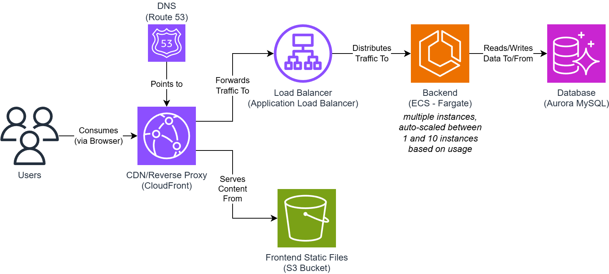

# Conduit - AI Augmented Design and Implementation

## Overview

In this assessment, you will work on a realistic task that closely resembles issues you may face on the job. You will extend a full-stack TypeScript project. The project has a NestJS backend and a React frontend. Your task is to add a new user story using the AI tool. The goal is to show your skills in planning and guiding the AI while keeping long-term code quality in mind.

The user story is around creating and editing articles, requiring you to change the data model and introduce a new technical pattern. Your implementation time will be tracked once the user story requirements are shown. Before revealing the user story requirements, please go through the content below.

In Production, this application is deployed on AWS following this architecture. Any changes you make must work within this architecture; otherwise, once your story is released, it will not work correctly.

(Optional) You may watch this video to get an overview of the assessment: https://drive.google.com/file/d/1sVMJHExraDkgBiflrBc9MRm-rhWybRv-/view

## Preparation Steps

Before starting the assessment, you should:

1. **Set Up GitHub Codespaces:**

   - Create a free GitHub account at [GitHub](https://github.com/signup).
   - Open the Codespace using [this link](https://github.com/codespaces/new?repo=678723453&ref=rwa/design-and-implementation-v1).
   - Your environment will automatically install all dependencies, seed the database, and start both the backend and frontend servers.
   - Visit [http://localhost:3001](http://localhost:3001) in your browser. Log in with:
     - **Email:** jcosten0@purevolume.com
     - **Password:** password

2. **Understand the Technologies:**

   - Review the project's technologies (NestJS, React, TypeScript, MySQL, AWS).
   - Understand the architecture from the provided diagram.

3. **Review the Codebase:**

   - **Frontend:** Located in the `frontend` folder.
   - **Backend:** Located in the `backend` folder (includes database migrations).
   - Spend time exploring the code to understand its structure and logic.
   - Understand how to extend the data model, expose an API, consume an API in the frontend, and how article authoring works.

4. **Use Aider:**

   - You must use the pre-installed Aider CLI for AI. You can check out the [Aider documentation](https://aider.chat/docs/usage/tutorials.html) to learn how to use it.
   - You will use an assessment-specific API key (provided on the Crossover page), which allows about 100 messages.

5. **Understand how to Plan:**

   - Read the [plan.md](./plan.md) file to know how to structure your implementation plan.

6. **Review Evaluation Criteria:**
   - Check the criteria to know how your work will be graded.

## Mandatory Rules

- **Do Not Fork**: Work on the provided repository. The submission script will malfunction if you fork the repository and push to it.
- **Use the Correct Branch**: Other assessment branches are in the repository. You must be on rwa/design-and-implementation-v1.
- **Single AI Tool**: Use Aider exclusively for AI interactions.
- **Include Screenshots**: Include screenshots of the acceptance tests passing. If you submit without screenshots, you'll get 0 stars.
- **Start with a Plan**: First derive your plan from the user story before implementing it. If you submit without a plan, you'll get 0 stars.
- **Preserve Aider Files**: Do not delete .aider.chat.history.md or .aider.input.history. If you submit without these files, you'll get 0 stars.

## Notes

- **API Docs:** You can find the API documentation at [http://localhost:3000/docs](http://localhost:3000/docs).
- **Testing:** The project does not include tests. You don't need to write any tests for this task.
- **Aider:** Think of Aider as a junior developer with good general knowledge but little context about the project. Provide clear instructions and reference specific files when asking for changes.
- **Tasks**: You can use the [Tasks](.vscode/tasks.json) ([docs](https://code.visualstudio.com/docs/editor/tasks)) and [Debug Launch Configurations](.vscode/launch.json) ([docs](https://code.visualstudio.com/docs/editor/debugging)) to start the app.
- **Codespaces**: Your codespace will stop after 30 minutes of inactivity. You can restart it from [here](https://github.com/codespaces) (your changes will be saved). It will be automatically deleted after 30 days of being stopped.
- **Database**: You can connect to the database using [these credentials](./backend/mikro-orm.config.ts). The Codespace has a MySQL extension that can connect to the database.
- **Environment:** If you cannot use Codespaces, you can [set up a local development environment](https://www.perplexity.ai/search/what-are-the-concise-precise-s-khlwVDwQTMODLaC6wB_7DQ).

## Evaluation Criteria

| **Criteria**       | **Description**                                    | **0 Stars**           | **1 Star**                    | **2 Stars**                                 | **3 Stars**                                          |
| ------------------ | -------------------------------------------------- | --------------------- | ----------------------------- | ------------------------------------------- | ---------------------------------------------------- |
| **Plan Soundness** | How clear and complete your plan is.               | No plan submitted     | Plan is incomplete or unclear | Some details missing and unclear rationale  | Clear, complete plan with detailed technical reasons |
| **Code Quality**   | Code cleanliness, efficiency, and maintainability. | Code is very messy    | Code quality is poor          | Mostly clean with minor issues              | Clean, efficient, and follows best practices         |
| **Correctness**    | Does the feature work as required?                 | Feature does not work | Only BASIC features work      | ADVANCED features work with some bugs       | Fully functional with no bugs                        |
| **AI Usage**       | How well you guide and use the AI tool.            | AI not used at all    | Basic or unclear usage        | Mostly clear instructions with minor issues | Clear, effective, and well-guided AI usage           |
| **Velocity**       | Time taken to complete the task.                   | Task not finished     | Took several days             | Completed in 6 hours or less                | Completed in 3 hours or less                         |

## Next Steps

Once you are ready, click the link on the Crossover assessment page to reveal the user story requirements. Create your plan, follow it, work carefully within the architecture, and ensure your changes integrate smoothly with the existing project. We recommend the following time budget:

- 0:30: Create your plan.
- 0:45: Implement the data model changes plus related frontend changes.
- 1:30: Add the new technical pattern, with the related backend and frontend changes.
- 0:15: Run the acceptance tests and submit your work.
